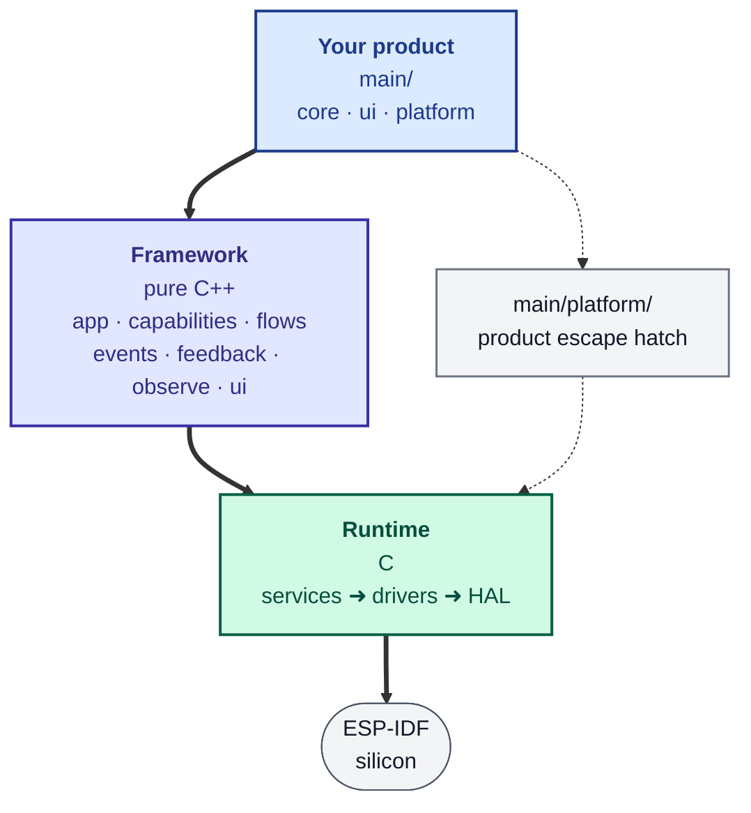

# Blusys

**Internal ESP32 product platform** on [ESP-IDF](https://docs.espressif.com/projects/esp-idf/) **v5.5+**. One dependency stack, one CLI, three supported silicon targets — **ESP32**, **ESP32-C3**, and **ESP32-S3** — and a product-facing API in `blusys::app` built around reducers, screens, and optional capabilities.

---

## Why this repo exists

Blusys is not a generic “better ESP-IDF.” It is a shared **operating model** for recurring product families: same app shape (`core/` · `ui/` · `platform/`), same `update(ctx, state, action)` loop, host-first iteration where it helps, and escape hatches to HAL and services when you need them.

### Product foundations

These are the grounding constraints for the platform.

**Mission.** Blusys is the **internal OS** for recurring product shapes — not a generic ESP32 framework. Optimize for what we ship: shared lifecycle, interaction grammar, and runtime orchestration. HAL, services, `blusys/drivers/display`, and low-level primitives stay available as **escape hatches**, not the default product path.

**B2C / B2B north stars.** The platform supports both consumer (B2C) and industrial / business (B2B) products on **one** shared model. For B2C, aim for interaction and character reminiscent of **[Teenage Engineering](https://teenage.engineering/)** — distinctive, tactile, concise, memorable. For B2B, aim for operational clarity reminiscent of **[Samsara](https://www.samsara.com/)** — readable, dependable, fluent, connected. These are design and outcome targets, not separate framework runtimes.

**Locked decisions.** Product API: **`blusys::app`** (C++ on the product path). App logic: reducer **`update(ctx, state, action)`** with **in-place** state mutation. Core runtime modes: **`interactive`** and **`headless`** only. Default onboarding: **host-first** interactive; secondary path: **headless-first** hardware. **Consumer** and **industrial** — the usual **B2C** vs **B2B** split — are product **lenses**, not framework branches (see **B2C / B2B north stars** above). Public term: **`capabilities`** (not “bundles”). First canonical interactive hardware profile: **generic SPI ST7735**, building on **ESP32**, **ESP32-C3**, and **ESP32-S3**. **Code-first** hardware and capability configuration; **Kconfig** for advanced tuning. **Raw LVGL** only inside custom widgets or an explicit custom view scope; UI drives behavior through **actions** and approved framework behavior.

**Product shape** (scaffold axes): **`--interface`** (`interactive` | `headless`), **`--with`** (framework capabilities), **`profile`** (named platform profile, or `null`), **`--policy`** (non-capability overlays such as `low_power`). Generated projects record the same shape in **`blusys.project.yml`**. Run **`blusys create --list`** for the current catalog.

**Default layout** (single local **`main/`** component): **`core/`** — state, actions, reducer, product behavior; **`ui/`** — screens and widgets from state, dispatch actions (**no direct runtime-service calls**); **`platform/`** — wiring, profile, capabilities, bridges (**thin assembly**, not business logic). Mirrors the framework: `core/` ↔ `framework/app/`+`capabilities/`+`flows/`, `ui/` ↔ `framework/ui/`, `platform/` ↔ `framework/platform/` (the sole escape hatch to HAL/drivers/services).

**Split.** The **app** owns state, actions, `update`, screens/views, optional profiles and capabilities. The **framework** owns boot/shutdown, loop/tick, routing, feedback, LVGL lifecycle and locks, overlays, host/device/headless adapters, input bridges, default service orchestration, and reusable flows. Use `ctx.fx()` for navigation, overlays, and filesystem handles exposed there — do not use `route_sink` directly from product code. Normal product code should not depend on `runtime.init`, `feedback_sink`, `blusys_display_lock`, `lv_screen_load`, raw LCD bring-up on the canonical path, or raw Wi-Fi orchestration on the canonical path.

**Non-goals.** Collapsing the three tiers; migrating runtime services to C++ as a product-path strategy; preserving obsolete product-facing APIs; a large reactive UI engine or heavy widget inheritance hierarchy; B2B vs B2C as framework runtime modes.

**Principles.** One strong default path; keep implementations small; add abstraction only when it removes real app burden; one fixed scaffold; runtime services stay in C, product composition in the framework.

**Validation.** Host smokes, scaffold checks, and CI expectations: **[docs/app/validation-host-loop.md](docs/app/validation-host-loop.md)**. Fast repo preflight: `blusys validate`. Inventory-driven example builds: `blusys build-inventory <target> <ci_pr|ci_nightly>`. Unified `blusys build` / `blusys qemu` (chip, `host`, `qemu*`): **[docs/app/cli-host-qemu.md](docs/app/cli-host-qemu.md)**.

---

## Quick start

```sh
# One-time install
git clone https://github.com/oguzkaganozt/blusys.git ~/.blusys
~/.blusys/install.sh

# New project (default interface: interactive)
mkdir ~/my_product && cd ~/my_product
blusys create

# Explicit shape — see: blusys create --list
# blusys create --interface headless --with connectivity,telemetry my_sensor

# Build, flash, and monitor (from the project directory)
blusys run /dev/ttyACM0 esp32s3
```

ESP-IDF **v5.5+** is required; the CLI discovers it. For the full walkthrough — product shape, connected products, host loop — start at **[Getting started](docs/start/index.md)**.

---

## Architecture

One ESP-IDF component (`components/blusys/`). Pure concept code on the left, escape hatches on the right, C runtime at the bottom:



**Rules** (enforced by `blusys lint`):
- `hal` depends on nothing above it. `drivers` → `hal`. `services` → `hal` + `drivers`.
- Pure framework (`app`, `capabilities`, `flows`, `events`, `feedback`, `observe`, `ui`) cannot include any lower layer. Only `framework/platform/` may bridge downward.
- Product `core/` and `ui/` are framework-only (pure). `main/platform/` is the product-level escape hatch and may include any layer directly.

| Layer | Role | Doc entry |
|-------|------|-----------|
| **Framework** | Product API, views, capabilities, host/device profiles | [App](docs/app/index.md) |
| **Services** | Runtime modules (connectivity, storage, system) | [Services](docs/services/index.md) |
| **Drivers** | Sensors, displays, and higher-level driver helpers | [HAL](docs/hal/index.md) |
| **HAL** | Registers, buses, and peripheral abstractions | [HAL](docs/hal/index.md) |

Module and example indices live in **`inventory.yml`** (CI and classification source of truth).

---

## Usage snippets

Examples and product code include exactly one public header. Everything else is internal and enforced by `check-public-api.sh`.

**C++ product code:**

```cpp
#include <blusys/blusys.hpp>   // framework + capabilities + fx + hal + drivers + services
```

**C code (HAL / drivers / services / observe primitives):**

```c
#include <blusys/blusys.h>
```

**CMake `REQUIRES`:**

```cmake
idf_component_register(SRCS "main.c"   REQUIRES blusys)
idf_component_register(SRCS "main.cpp" REQUIRES blusys)
```


---

## Host harness

SDL2 + LVGL host iteration on Linux for fast UI and smoke-test loops without flashing every change. `scripts/host/` holds the interactive demos and host smokes; `scripts/host-test/` is the minimal no-SDL headless loop. Setup: **[scripts/host/README.md](scripts/host/README.md)**.

```sh
sudo apt install libsdl2-dev   # or your distro’s SDL2 dev package
blusys host-build
./scripts/host/build-host/hello_lvgl
```

---

## Examples

| Path | Purpose |
|------|---------|
| `examples/reference/` | Deeper demos and per-area examples, nightly CI |
| `examples/validation/` | Internal smoke and stress, nightly CI |

The quickstart starters are temporarily removed while the manifest-first scaffold is being rewritten. See `APP_MANIFEST_REFACTOR_PLAN.md`.

Details and flags: **`inventory.yml`**.

---

## Documentation

**[Published site](https://oguzkaganozt.github.io/blusys/)** — Start → App → Services → HAL → Internals.

Local preview:

```sh
pip install -r requirements-docs.txt
mkdocs serve
```

---

## Project status

Current **package version** is **7.0.0** (`BLUSYS_VERSION_STRING` in [`components/blusys/include/blusys/hal/version.h`](components/blusys/include/blusys/hal/version.h); also `blusys version`).

---

## License

See **[LICENSE](LICENSE)**.
