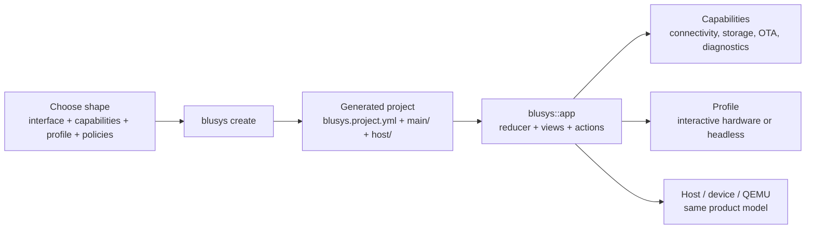

# Blusys Platform

Blusys is an internal ESP32 product platform built on ESP-IDF v5.5.4. It gives product teams one shape, one app model, and one path from host-first iteration to hardware.

!!! tip "The shortest path"
    Decide the product shape, scaffold it, run it on host, then add capabilities and a profile only when the product needs them.

-   :material-rocket-launch:{ .lg .middle } **Start Here**

    ---

    Choose a shape, create a project, and get the first binary running.

    [Getting Started](start/index.md)

-   :material-cube-outline:{ .lg .middle } **App**

    ---

    Build product behavior with reducers, views, capabilities, and profiles.

    [App Overview](app/index.md)

-   :material-connection:{ .lg .middle } **Services**

    ---

    Use runtime modules directly when you need their exact lifecycle.

    [Browse Services](services/index.md)

-   :material-chip:{ .lg .middle } **HAL + Drivers**

    ---

    Drop below the framework only when you need direct hardware control.

    [Browse HAL](hal/index.md)

-   :material-wrench:{ .lg .middle } **Internals**

    ---

    Architecture, checks, target support, and testing.

    [Internals](internals/index.md)

## How Blusys works

## First Reads

1. [Start](start/index.md) - the onboarding path
2. [App](app/index.md) - how product code stays small
3. [Services](services/index.md) and [HAL + Drivers](hal/index.md) - lower layers when needed
4. [Internals](internals/index.md) - architecture and checks

## Supported Targets

| Target | Status |
|--------|--------|
| ESP32 | Supported |
| ESP32-C3 | Supported |
| ESP32-S3 | Supported |

See [Target Matrix](internals/target-matrix.md) for the full per-module support matrix.
