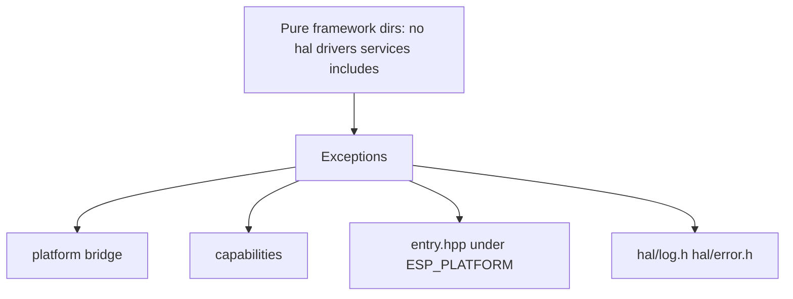

# Architecture

Tiering, include rules, and where code lives. For mission, install, and the high-level stack diagram, see the repository [README](https://github.com/oguzkaganozt/blusys/blob/main/README.md). For product API usage, see [App](../app/index.md).

## At a glance

- **You are** a contributor changing `components/blusys/` or wiring a product to the tiers.
- **You need** the dependency direction, the layer model, and where HAL vs framework files sit.
- **Next** [Guidelines](guidelines.md) for API shape, then [Contributing](contributing.md) for checks.

The repo ships a single ESP-IDF component `components/blusys/` with four internal layers sharing the `blusys/` header namespace:

```text
components/blusys/
  include/blusys/hal/        HAL — peripheral wrappers, target capabilities
  include/blusys/drivers/    Drivers — device drivers built on HAL (display, input, sensor, actuator)
  include/blusys/services/   Services — stateful runtime modules (wifi, mqtt, ota, …)
  include/blusys/framework/  Framework — product API and UI widget kit (C++)
  src/
    hal/
    drivers/
    services/
    framework/
```

The public include namespace stays `blusys/...` across all layers.

## Guiding Principles

- keep the public surface smaller than raw ESP-IDF
- support one shared platform across `esp32`, `esp32c3`, and `esp32s3`
- keep target-specific and ESP-IDF-specific details behind internal boundaries
- give product code a clear answer to "where does this belong?"

**Success means:** examples build on all supported targets, the layering rules are obvious, and product code does not need to understand low-level ESP-IDF details just to get started.

**Non-goals:** mirroring every ESP-IDF feature, exposing internal HAL details publicly, or adding board-specific product helpers to the core platform.

## Four-Layer Model

```text
Product / example app
  → Framework API           (include/blusys/framework/...)    C++, namespace blusys
  → Services API            (include/blusys/services/...)     C
  → Drivers API             (include/blusys/drivers/...)      C
  → HAL API                 (include/blusys/hal/...)          C
  → ESP-IDF
```

Dependency direction is one-way:


(`hal` and `hal/log.h` / `hal/error.h` have no upward includes; nothing below ESP-IDF pulls Blusys headers.)

Reverse dependencies are forbidden. `hal/log.h` and `hal/error.h` are
cross-cutting utilities allowed at any layer (analogous to `stdio.h`).

## Layering Rules

Seven rules are enforced by CI:

**Rule 1** — `hal/` headers may not include `drivers/`, `services/`, or `framework/` headers.

**Rule 2** — `drivers/` headers may not include `services/` or `framework/` headers.

**Rule 3** — `services/` headers may not include `framework/` headers.

**Rule 4** — Pure framework sub-dirs (`events/`, `feedback/`, `ui/`, `app/`, `flows/`, `observe/`)
may not include `hal/`, `drivers/`, or `services/` headers, except:
- `blusys/hal/log.h` and `blusys/hal/error.h` (cross-cutting utilities)
- `framework/app/entry.hpp` (device boot bridge — guarded by `#ifdef ESP_PLATFORM`)
- `framework/platform/` (sole designated escape hatch for device integration)
- `framework/capabilities/` (wraps services; exempt from Rule 4)



**Rule 5** — Every `src/` file has a corresponding `include/blusys/` header (forward
check), and every C-layer `include/blusys/` header (hal/drivers/services) has a
corresponding `src/` implementation (reverse check). Framework headers are exempt
from the reverse check (many legitimate header-only types and templates).

**Rule 6** — No `include/blusys/**/*.{h,hpp}` file may have a `blusys_` prefix in its
basename.

**Rule 7** — Every `.hpp` and `.cpp` under `src/framework/` and
`include/blusys/framework/` must be wrapped in `namespace blusys`.

Rules 1–4 are enforced by `scripts/lint-layering.sh`. Rules 5–7 are enforced by
dedicated Python scripts (`check-src-include-mirror.py`, `check-no-blusys-prefix.py`,
`check-cpp-namespace.py`). The host bridge sync is checked by `check-host-bridge-spine.py`.

## Layer Details

### HAL (`include/blusys/hal/`, `src/hal/`)

Peripheral wrappers and target capabilities — the layer closest to the MCU.

- foundational: `version`, `error`, `target`, `system`, `efuse`
- retained low-power task engine: `ulp`
- stateless pin API: `gpio`
- handle-based master/TX APIs: `uart`, `i2c`, `spi`, `pwm`, `adc`, `timer`, `rmt`,
  `i2s`, `twai`, `pcnt`, `dac`, `sdm`, `mcpwm`, `touch`, `sdmmc`, `temp_sensor`,
  `wdt`, `sleep`, `usb_host`, `usb_device`
- handle-based slave/RX counterparts: `i2c_slave`, `spi_slave`, `i2s_rx`, `rmt_rx`
- storage: `nvs`, `sd_spi`
- external bus-backed peripherals: `one_wire`, `gpio_expander`

Umbrella header:

```c
#include "blusys/blusys.h"
```

### Drivers (`include/blusys/drivers/`, `src/drivers/`)

Device drivers composed from HAL primitives.

- display: `lcd`, `led_strip`, `seven_seg`
- input: `button`, `encoder`
- sensor: `dht`
- actuator: `buzzer`
- display (moved here from services in v0): `display`

### Services (`include/blusys/services/`, `src/services/`)

Stateful runtime modules built on HAL + drivers.

- connectivity/transports: `wifi`, `wifi_prov`, `wifi_mesh`, `espnow`, `bluetooth`, `ble_gatt`
- connectivity/protocols: `http_client`, `http_server`, `mqtt`, `ws_client`, `mdns`, `sntp`, `local_ctrl`
- storage: `fatfs`, `fs`
- device: `ota`, `power_mgmt`, `console`
- input: `usb_hid`

### Framework (`include/blusys/framework/`, `src/framework/`)

The framework tier is the only C++ layer, with `-fno-exceptions -fno-rtti` and a
fixed-capacity allocation policy. All types live in `namespace blusys`.

#### Product API (`include/blusys/framework/app/`)

Normal product code only touches this layer.

- `app.hpp` — umbrella include for the product API
- `spec.hpp` — `app_spec<State, Action>` template: initial state, `update()` reducer,
  lifecycle hooks (`on_init`, `on_tick`, `on_event`), capability config, theme
- `ctx.hpp` — `app_ctx`: dispatch actions, emit feedback, query capability status,
  `product_state`, `get<T>()` / `status_of<T>()`; `fx()` returns `app_fx &` for typed
  navigation and capability-owned effects (connectivity / storage / telemetry /
  settings / diagnostics / build)
- `entry.hpp` — entry macros: `BLUSYS_APP(spec)` and `BLUSYS_APP_HEADLESS(spec)`
- `internal/app_runtime.hpp` — runtime engine (internal, driven by the entry macros)

**View layer** (`include/blusys/framework/ui/`, gated by `BLUSYS_BUILD_UI`):
see [Widget kit](#widget-kit) below.

**Platform profiles** (`include/blusys/framework/platform/profiles/`):
- `st7735.hpp`, `st7789.hpp` — SPI TFT profiles (interactive compact)
- `ili9341.hpp`, `ili9488.hpp` — SPI TFT profiles (interactive dashboard)
- `ssd1306.hpp` — I2C mono OLED profile
- `qemu_rgb.hpp` — virtual RGB framebuffer for QEMU runs

See [docs/app/profiles.md](../app/profiles.md) for interface-to-profile guidance.

**Capabilities** (`include/blusys/framework/capabilities/`):
- `connectivity.hpp` — Wi-Fi, SNTP, mDNS, local control lifecycle
- `storage.hpp` — SPIFFS and FAT filesystem mounting
- `telemetry.hpp` — telemetry buffering and delivery
- `persistence.hpp` — compile-time schema discovery + NVS
- `diagnostics.hpp` — uptime, free heap, crash dumps
- `build_info.hpp` — version / build metadata
- `bluetooth.hpp`, `ble_hid_device.hpp`, `mqtt.hpp`, `ota.hpp`,
  `lan_control.hpp`, `provisioning.hpp`, `usb.hpp` — additional capability modules
- `example_sensor.hpp` — canonical template for new capabilities

#### Events (`include/blusys/framework/events/`)

Internal framework spine. Product code does not interact with it directly.

- `router.hpp` — six route commands (`set_root`, `push`, `replace`, `pop`,
  `show_overlay`, `hide_overlay`) plus a `route_sink` interface
- `event_queue.hpp` — event ring buffer and dispatch helpers
- `event.hpp` — semantic intents (`press`/`long_press`/`release`/`confirm`/
  `cancel`/`increment`/`decrement`/`focus_next`/`focus_prev`) and the `app_event` envelope

#### Feedback (`include/blusys/framework/feedback/`)

- `feedback.hpp` — three channels (`visual`/`audio`/`haptic`), six patterns,
  fixed-capacity bus
- `presets.hpp` — pre-built feedback patterns

#### Platform bridge (`src/framework/platform/`)

The designated escape hatch for device-specific framework integration (touch bridge,
input bridge, device platform entry). Only this sub-directory may include HAL/driver/service
headers from within the framework layer.

#### Widget kit {#widget-kit}

(`include/blusys/framework/ui/`, gated by `BLUSYS_BUILD_UI`)

- `style/theme.hpp` — single `theme_tokens` struct populated at boot, `set_theme()` / `theme()` accessors
- `style/callbacks.hpp` — semantic callback types (`press_cb_t`, `toggle_cb_t`, `change_cb_t`, …)
- `primitives.hpp` — umbrella over layout primitives (`screen`, `row`, `col`, `label`,
  `divider`, `icon_label`, `status_badge`, `key_value`, …)
- `widgets.hpp` — umbrella over primitives plus stock widgets (`button`, `toggle`,
  `slider`, `modal`, `overlay`, `progress`, `list`, `card`, `tabs`, `dropdown`, `gauge`,
  `knob`, `chart`, `data_table`, `input_field`, `level_bar`, `vu_strip`, …)
- `input/encoder.hpp` — `create_encoder_group` + `auto_focus_screen`
- `binding/bindings.hpp` — reactive data bindings for text, value, enabled, visible
- `binding/action_widgets.hpp` — pre-built action-dispatching widgets
- `composition/` — `page`, `screen_registry`, `screen_router`, `shell`, `overlay_manager`, `controller/navigation_controller`

Authoring contract: every widget follows the six-rule contract (theme tokens only,
config struct interface, setters own state transitions, standard state set, one folder
per widget, header is the spec). Stock-backed widgets use a fixed-capacity slot pool
keyed by `BLUSYS_UI_<NAME>_POOL_SIZE`. See the **Widget kit** section above for the
contract details.

## CMake Usage

Single component for all layers:

```cmake
idf_component_register(SRCS "main.c" REQUIRES blusys)
```

Two consumption models, deliberately separated:

- **Bundled examples** in `examples/` are discovered via `EXTRA_COMPONENT_DIRS`
  (typically `${BLUSYS_REPO_ROOT}/components`) in each example's top-level
  `CMakeLists.txt`.
- **Scaffolded product apps** from `blusys create [--interface …] [--profile …] [--with …] [--policy …]`
  use the same mechanism: the generated top-level `CMakeLists.txt` embeds
  `EXTRA_COMPONENT_DIRS` pointing at the `components/` tree from the checkout
  used at generation time. Product code stays under `main/`; interactive apps
  may add `ui/` when needed, and `app_main.cpp` stays thin and explicit. See
  [Product shape](../start/product-shape.md) and [Interactive Quickstart](../start/quickstart-interactive.md);
  [App](../app/index.md) covers the product model.

## Symmetric Pairs

Some HAL modules expose the same peripheral in both directions under separate handles:

- I2C: `blusys_i2c_master_*` and `blusys_i2c_slave_*`
- SPI: `blusys_spi_*` and `blusys_spi_slave_*`
- I2S: `blusys_i2s_tx_*` and `blusys_i2s_rx_*`
- RMT: `blusys_rmt_*` and `blusys_rmt_rx_*`

## Design Rationale

**Single merged component.** One `components/blusys/` replaces the old three-component model (`blusys_hal`, `blusys_services`, `blusys_framework`). Same encapsulation, no cross-component `REQUIRES` overhead.

**HAL and drivers stay C.** Explicit lifecycle and deterministic behavior matter most at the MCU boundary; C++ encapsulation adds no meaningful benefit here.

**Services stay C.** Existing service implementations (`wifi.c`, `mqtt.c`, `ota.c`) are already well-factored around opaque handles; migration to C++ would be speculative churn.

**Framework is C++.** Designated initializers, captureless lambdas, `enum class`, and templates earn their keep in the widget kit and state machine layer.

**Single namespace `blusys`.** All framework types live directly in `namespace blusys` — no sub-namespace disambiguation in product code.

**Fixed-capacity allocation.** Framework spine and widget kit never call `new`/`malloc` after init. Static pools sized by KConfig; fail-loud assert on exhaustion.

**Single version tag.** All layers ship under one git tag; one pin in `idf_component.yml`.

**Theme as one struct.** `theme_tokens` is populated at boot, read by every widget. No JSON pipeline.

**Six-rule widget contract.** Every widget follows the same contract (theme tokens only, config struct, setters own transitions, standard state, one folder, header is the spec).

## Lifecycle Verbs

Lifecycle verbs stay explicit where relevant:

- `open`
- `close`
- `start`
- `stop`
- `read`
- `write`
- `transfer`

## Target Policy

The platform targets the common subset of `esp32`, `esp32c3`, and `esp32s3`. Modules
not available on all three targets use capability checks and return
`BLUSYS_ERR_NOT_SUPPORTED` on unsupported hardware. See [Target matrix](target-matrix.md)
for the full matrix.

???+ note "UI and SPI display notes (LVGL flex, ST7735 flush)"

    ## UI layout (LVGL flex) {#ui-layout-lvgl-flex}

    The framework uses LVGL's built-in flex and scroll so product code declares structure
    (columns, rows, shell) without reimplementing layout rules.

    **Principles:**

    1. **Prefer LVGL flex** (`LV_LAYOUT_FLEX`, `lv_obj_set_flex_flow`, `lv_obj_set_flex_align`). No parallel layout engine.
    2. **Bound the scroll viewport.** The shell's scrollable page column must be a flex child with bounded height (`shell` `content_area` + `page_create_in`) so chrome (tabs, header) is not pushed off-screen.
    3. **Stock widgets size to constraints.** Widgets placed in flex rows with a fixed row height must respect the allocated size (`gauge` scales its arc on `LV_EVENT_SIZE_CHANGED` via `blusys::flex_layout::effective_cross_extent_for_row_child`).
    4. **Escape hatch.** Custom product UI may use raw LVGL inside custom widgets or an explicit custom scope, keeping the same focus/action/runtime contracts as the six-rule widget contract above.

    **Primitives:**

    - `col` / `row` — flex column/row helpers. `row_config` / `col_config` expose main/cross/track flex align (`row` defaults: `START`, `CENTER`, `CENTER`; `col`: `START`, `START`, `START`).
    - `blusys::flex_layout` — helpers for flex row/column parents (`effective_cross_extent_for_row_child`, `effective_cross_extent_for_column_child`) when a child's content-sized dimension under-reports the strip.
    - `page_create` / `page_create_in` — page column; the in-shell variant sets `flex_grow(1)`, `min_height(0)`, and optional scroll so the column fills `content_area` correctly.

    **Shell:** column flex root — header, optional status, `content_area` (`flex_grow(1)`), optional tab bar. `content_area` is itself a column flex container so its single child (the scrollable page column) participates as a proper flex item.

    ## Display notes: ST7735 on SPI

    `blusys_st7735_panel_draw_bitmap()` in `components/blusys/src/drivers/display/lcd.c` sends **one display row per `RAMWR`** (each row: `COLMOD` + `CASET` + `RASET` + `RAMWR`). Packing several scanlines into one `RASET` window plus one long `RAMWR` caused diagonal shear on some ST7735 SPI modules; the per-row path fixes it. `COLMOD` is re-asserted per transaction and once more after the last `RAMWR` so DMA completion is synchronized before the source buffer is reused. Throughput is lower than multi-row bursts; override only with validated hardware.

    LVGL's partial-mode `flush_cb` in `components/blusys/src/services/display/ui.c` copies each dirty region from `px_map` using `lv_draw_buf_width_to_stride(area_width, cf)`, packs into the DMA scratch buffer, optionally byte-swaps RGB565 for SPI, and calls `blusys_lcd_draw_bitmap()`. `lv_display_flush_ready()` runs after all SPI/DMA for that flush completes.

    SPI default for `st7735_160x128()` is 16 MHz; lower `pclk_hz` in product integration if wiring is marginal. Typical x/y gap offsets for 160×128 modules remain in the profile; tune per glass as needed.
